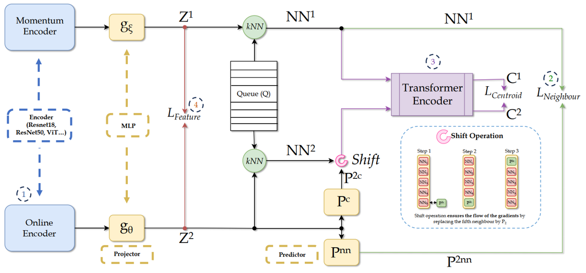

# All4One
### Symbiotic Neighbour Contrastive Learning via Self-Attention and Redundancy Reduction (ICCV'23)





Official PyTorch implementation of the paper:

**All4One: Symbiotic Neighbour Contrastive Learning via Self-Attention and Redundancy Reduction**

*Imanol G. Estepa, Ignacio Sarasúa, Bhalaji Nagarajan, and Petia Radeva*

To enhance the fair comparison of different self-supervised methods, the code is provided as an addition to [solo-learn](https://github.com/vturrisi/solo-learn) SSL library. Even so, trained models can be used as backbones for tasks not included in this repository.

## Installation

First clone the repo.

Then, to install solo-learn with [Dali](https://github.com/NVIDIA/DALI) and/or UMAP support, use:
```bash
pip3 install .[dali,umap,h5] --extra-index-url https://developer.download.nvidia.com/compute/redist
```

If no Dali/UMAP/H5 support is needed, the repository can be installed as:
```bash
pip3 install .
```

Additionally, All4One requires the installation of positional-encodings dependency, it can be installed with the following command:

```bash
pip3 install positional-encodings
```

The exact dependency versions can be found on the *requirements.txt* file

---

## Training

Training configurations are provided in `scripts/pretrain/` folder. They can be executed by:

```bash
python3 main_pretrain.py \
    # path to training script folder
    --config-path scripts/pretrain/cifar/ \
    # training config name
    --config-name all4one.yaml
    # add new arguments (e.g. those not defined in the yaml files)
    # by doing ++new_argument=VALUE
    # pytorch lightning's arguments can be added here as well.
```

*launcher.py* file wraps up the command to initialize the training with:
```bash
python3 launcher.py
```

For downstream task evaluation, we recommend following official [solo-learn](https://github.com/vturrisi/solo-learn) tutorials.

---


## Results

### CIFAR-10

| Method       | Backbone | Epochs | Dali | Acc@1 (Online)| Acc@5 (Online)|
|--------------|:--------:|:------:|:----:|:--------------:|:--------------:|
| Barlow Twins | ResNet18 |  1000  |  :x: |      92.10     |     99.73      |
| BYOL         | ResNet18 |  1000  |  :x: |      92.58     |     99.79      |
|DeepCluster V2| ResNet18 |  1000  |  :x: |      88.85     |     99.58      | 
| DINO         | ResNet18 |  1000  |  :x: |      89.52     |     99.71      | 
| MoCo V2+     | ResNet18 |  1000  |  :x: |      92.94     |     99.79      | 
| MoCo V3      | ResNet18 |  1000  |  :x: |      93.10     |     99.80      | 
| NNCLR        | ResNet18 |  1000  |  :x: |      91.88     |     99.78      | 
| ReSSL        | ResNet18 |  1000  |  :x: |      90.63     |     99.62      | 
| SimCLR       | ResNet18 |  1000  |  :x: |      90.74     |     99.75      | 
| Simsiam      | ResNet18 |  1000  |  :x: |      90.51     |     99.72      | 
| SupCon       | ResNet18 |  1000  |  :x: |      93.82     |     99.65      | 
| SwAV         | ResNet18 |  1000  |  :x: |      89.17     |     99.68      | 
| VIbCReg      | ResNet18 |  1000  |  :x: |      91.18     |     99.74      | 
| VICReg       | ResNet18 |  1000  |  :x: |      92.07     |     99.74      | 
| W-MSE        | ResNet18 |  1000  |  :x: |      88.67     |     99.68      | 
| All4One        | ResNet18 |  1000  |  :x: |      93.24     |     99.88      | 


### CIFAR-100

| Method       | Backbone | Epochs | Dali | Acc@1 (Online)| Acc@5 (Online)|
|--------------|:--------:|:------:|:----:|:--------------:|:--------------:|
| Barlow Twins | ResNet18 |  1000  |  :x: |      70.90     |     91.91      | 
| BYOL         | ResNet18 |  1000  |  :x: |      70.46     |     91.96      | 
|DeepCluster V2| ResNet18 |  1000  |  :x: |      63.61     |     88.09      | 
| DINO         | ResNet18 |  1000  |  :x: |      66.76     |     90.34      | 
| MoCo V2+     | ResNet18 |  1000  |  :x: |      69.89     |     91.65      | 
| MoCo V3      | ResNet18 |  1000  |  :x: |      68.83     |     90.57      | 
| NNCLR        | ResNet18 |  1000  |  :x: |      69.62     |     91.52      | 
| ReSSL        | ResNet18 |  1000  |  :x: |      65.92     |     89.73      | 
| SimCLR       | ResNet18 |  1000  |  :x: |      65.78     |     89.04      | 
| Simsiam      | ResNet18 |  1000  |  :x: |      66.04     |     89.62      | 
| SupCon       | ResNet18 |  1000  |  :x: |      70.38     |     89.57      | 
| SwAV         | ResNet18 |  1000  |  :x: |      64.88     |     88.78      | 
| VIbCReg      | ResNet18 |  1000  |  :x: |      67.37     |     90.07      | 
| VICReg       | ResNet18 |  1000  |  :x: |      68.54     |     90.83      | 
| W-MSE        | ResNet18 |  1000  |  :x: |      61.33     |     87.26      | 
| All4One        | ResNet18 |  1000  |  :x: |      72.17     |     93.35      | 

### ImageNet-100

| Method                  | Backbone | Epochs |        Dali        | Acc@1 (online) | Acc@5 (online) |
|-------------------------|:--------:|:------:|:------------------:|:--------------:|:---------------:|
| Barlow Twins :rocket:   | ResNet18 |   400  | :heavy_check_mark: |      80.38     |      95.28     |
| BYOL         :rocket:   | ResNet18 |   400  | :heavy_check_mark: |      80.16     |      95.02     |
| DeepCluster V2          | ResNet18 |   400  |         :x:        |      75.36     |      93.22     |
| DINO                    | ResNet18 |   400  | :heavy_check_mark: |      74.84     |      92.92     |
| DINO         :sleepy:   | ViT Tiny |   400  |         :x:        |      63.04     |      87.72     |
| MoCo V2+     :rocket:   | ResNet18 |   400  | :heavy_check_mark: |      78.20     |      95.50     |
| MoCo V3      :rocket:   | ResNet18 |   400  | :heavy_check_mark: |      80.36     |     95.18     |
| NNCLR        :rocket:   | ResNet18 |   400  | :heavy_check_mark: |      79.80     |     95.28     |
| ReSSL                   | ResNet18 |   400  | :heavy_check_mark: |      76.92     |     94.20     |
| SimCLR       :rocket:   | ResNet18 |   400  | :heavy_check_mark: |      77.64     |     94.06     | 
| Simsiam                 | ResNet18 |   400  | :heavy_check_mark: |      74.54     |     93.16     | 
| SupCon                  | ResNet18 |   400  | :heavy_check_mark: |      84.40     |   95.72     |
| SwAV                    | ResNet18 |   400  | :heavy_check_mark: |      74.04     |    92.70     | 
| VIbCReg                 | ResNet18 |   400  | :heavy_check_mark: |      79.86     |     94.98     | 
| VICReg       :rocket:   | ResNet18 |   400  | :heavy_check_mark: |      79.22     |     95.06     | 
| W-MSE                   | ResNet18 |   400  | :heavy_check_mark: |      67.60     |    90.94     | 
| All4One                   | ResNet18 |   400  | :heavy_check_mark: |      81.93     |     96.23     | 

:rocket: methods where hyperparameters were heavily tuned. More results and ablations in the [paper](https://openaccess.thecvf.com/content/ICCV2023/html/Estepa_All4One_Symbiotic_Neighbour_Contrastive_Learning_via_Self-Attention_and_Redundancy_Reduction_ICCV_2023_paper.html).


## Citation
If you find All4One useful, please cite our [paper](https://openaccess.thecvf.com/content/ICCV2023/html/Estepa_All4One_Symbiotic_Neighbour_Contrastive_Learning_via_Self-Attention_and_Redundancy_Reduction_ICCV_2023_paper.html):
```bibtex
@InProceedings{Estepa_2023_ICCV,
    author    = {Estepa, Imanol G. and Sarasua, Ignacio and Nagarajan, Bhalaji and Radeva, Petia},
    title     = {All4One: Symbiotic Neighbour Contrastive Learning via Self-Attention and Redundancy Reduction},
    booktitle = {Proceedings of the IEEE/CVF International Conference on Computer Vision (ICCV)},
    month     = {October},
    year      = {2023},
    pages     = {16243-16253}
}
```
## Acknowledgements
This work was partially funded by the Horizon EU project MUSAE (No. 01070421), 2021-SGR-01094 (AGAUR), Icrea Academia’2022 (Generalitat de Catalunya), Robo STEAM (2022-1-BG01-KA220-VET-000089434, Erasmus+ EU), DeepSense(ACE053/22/000029, ACCIO), DeepFoodVol (AEI-MICINN, PDC2022-133642-I00), PID2022-141566NB-I00 (AEI-MICINN), and CERCA Programme / Generalitatde Catalunya. B. Nagarajan acknowledges the support of FPI Becas, MICINN, Spain.